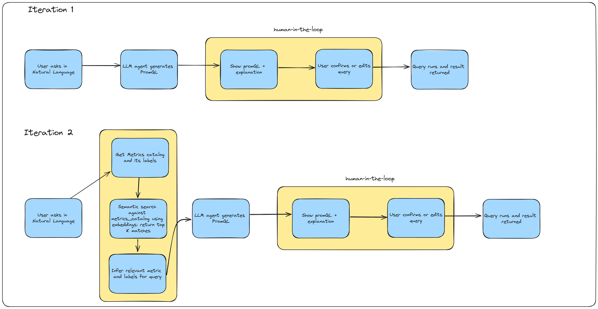
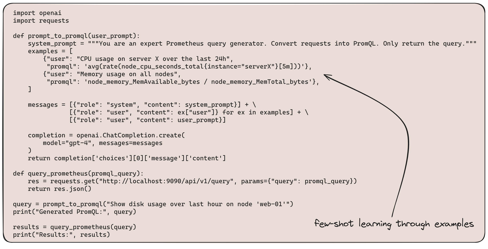

# Overview

**Cyclops** is a prototype framework that leverages large language models (LLMs) for converting natural language queries into PromQL, simplifying infrastructure monitoring and metrics analysis. The current implementation focuses on few-shot learning and semantic search to extract user intent and generate accurate PromQL queries. While the prototype does not yet utilize a knowledge graph, future iterations may explore its integration to enhance context understanding and query generation. **Cyclops** is designed with flexibility in mind, making it adaptable to other monitoring systems beyond Prometheus with minimal adjustments and easily extensible to support new systems through the use of the MCP protocol.

For full source code of this project please visit [repo template](https://github.com/joagonzalez/cyclops-devops-agent/).

## Prototype of the solution

## An idea on how to implement few-shot learning

## How to use this repo
Please check how to use this repository in the repo [README](https://github.com/joagonzalez/cyclops-devops-agent/blob/master/README.md) file

## Open issues
Please check open issues at [github](https://github.com/joagonzalez/cyclops-devops-agent/issues)

## Changelog

[v0.1.0]
- Documentation migrated to readthedocs service
- Dynamic badges for coverage (github acions), documentation as stated before, build status (github actions)
- API basic unit tests added
- ruff and mypy for linting and static analysis
- uv for packet management
- basic tests with pytest